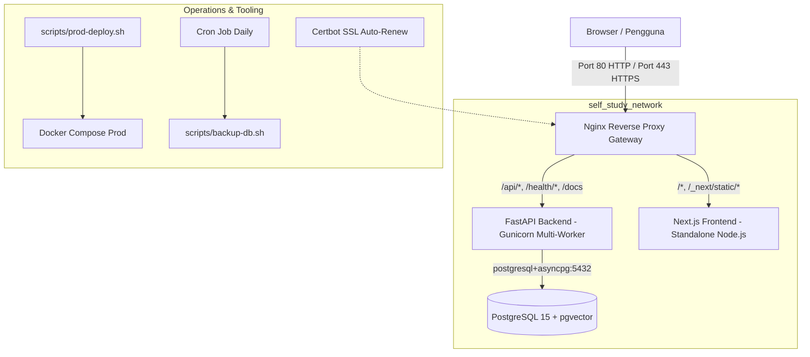

# Panduan Deployment Tahap Produksi (Production Guide)
## Self Study OS

Dokumen ini adalah panduan operasional end-to-end untuk menjalankan sistem **Self Study OS** di lingkungan produksi (VPS, Cloud Server, atau On-Premises Server) secara aman, efisien, dan andal.

---

## 1. Arsitektur Produksi

Di lingkungan produksi, seluruh traffic luar masuk melalui satu pintu gerbang (**Nginx Gateway**), sementara layanan database, backend, dan frontend diisolasi dalam private network Docker.



### Keunggulan Arsitektur Produksi Ini:
1. **Keamanan Port Terisolasi**: Port database `5432`, port backend `8000`, dan port frontend `3000` **tidak diekspos** ke internet publik.
2. **Reverse Proxy & SSL**: Nginx menangani terminasi SSL HTTPS, kompresi Gzip, caching file statis Next.js, dan security headers (HSTS, CSP, X-Frame-Options).
3. **High-Performance ASGI Server**: Backend dijalankan menggunakan Gunicorn process manager dengan Uvicorn workers (`gunicorn -w 4 -k uvicorn.workers.UvicornWorker`).
4. **Resilience & Resource Limits**: Setiap kontainer dibatasi alokasi memorinya untuk mencegah kehabisan memori (*Out Of Memory / OOM*) pada VPS.
5. **Log Rotation**: Semua log kontainer menggunakan driver `json-file` dengan limit 10MB per file dan rotasi 3 file agar disk server tidak penuh.

---

## 2. Persyaratan Minimum Server

- **OS**: Ubuntu 22.04 LTS / 24.04 LTS atau Debian 12
- **CPU**: 2 vCPU atau lebih
- **RAM**: Minimum 2 GB (Rekomendasi 4 GB untuk beban kerja AI dan simulasi)
- **Disk**: 20 GB SSD
- **Software**:
  - Docker Engine (v24+)
  - Docker Compose (v2.20+)
  - Git
  - UFW (Firewall)

---

## 3. Persiapan Server & Keamanan Awal

### 3.1. Update Server & Instal Docker
Jalankan di server Ubuntu/Debian:
```bash
sudo apt update && sudo apt upgrade -y
sudo apt install -y curl git ufw fail2ban

# Instal Docker & Docker Compose Plugin
curl -fsSL https://get.docker.com | sh
sudo usermod -aG docker $USER
```

### 3.2. Konfigurasi Firewall (UFW)
Buka hanya port SSH, HTTP, dan HTTPS:
```bash
sudo ufw default deny incoming
sudo ufw default allow outgoing
sudo ufw allow ssh
sudo ufw allow 80/tcp
sudo ufw allow 443/tcp
sudo ufw enable
```
> [!IMPORTANT]
> Jangan pernah membuka port `5432`, `8000`, atau `3000` di firewall UFW pada server produksi!

---

## 4. Langkah Deployment Langkah-demi-Langkah

### 4.1. Clone Repository ke Server
```bash
cd /opt
sudo git clone https://github.com/<your-username>/self-study-os.git self-study-os
cd self-study-os
sudo chown -R $USER:$USER /opt/self-study-os
```

### 4.2. Konfigurasi Environment Produksi
Salin template konfigurasi:
```bash
cp .env.production.example .env.production
```

Buka dan edit `.env.production`:
```bash
nano .env.production
```
Pastikan mengubah nilai berikut:
1. **`POSTGRES_PASSWORD`**: Masukkan password database yang kuat dan unik.
2. **`SECRET_KEY`**: Buat kunci acak dengan perintah:
   ```bash
   openssl rand -hex 32
   ```
   Lalu tempel hasilnya ke `SECRET_KEY=...`.
3. **`CORS_ORIGINS`** & **`FRONTEND_URL`**: Arahkan ke domain Anda (misal `https://learn.selfstudy.dev`) atau IP server.
4. **API Keys AI** (*Opsional*): Masukkan `OPENAI_API_KEY`, `ANTHROPIC_API_KEY`, dsb. jika ingin mengaktifkan fitur tutor cerdas.

### 4.3. Berikan Izin Eksekusi pada Scripts
```bash
chmod +x scripts/*.sh backend/docker-entrypoint.sh
```

### 4.4. Jalankan Deployment
Gunakan script deployment otomatis yang telah disediakan:
```bash
./scripts/prod-deploy.sh
```

---

## 5. Konfigurasi Domain & SSL HTTPS (Let's Encrypt)

Untuk mengaktifkan HTTPS gratis dengan pembaruan otomatis:

1. Arahkan DNS **A Record** dari domain Anda ke IP publik server.
2. Jalankan script inisialisasi SSL otomatis:
   ```bash
   ./scripts/init-ssl.sh learn.selfstudy.dev admin@selfstudy.dev
   ```
   *Ganti dengan nama domain dan email Anda.*
3. Kontainer `certbot` akan otomatis memperbarui sertifikat setiap 12 jam jika masa berlaku tersisa di bawah 30 hari.

---

## 6. Backup & Pemulihan Database

### 6.1. Backup Manual
Jalankan script backup database kapan saja:
```bash
./scripts/backup-db.sh
```

### 6.2. Otomatisasi Backup Harian (Cron Job)
Tambahkan ke cron job server:
```bash
crontab -e
```
Tambahkan baris berikut untuk backup otomatis setiap pukul 02:00 dini hari:
```cron
0 2 * * * /opt/self-study-os/scripts/backup-db.sh >> /var/log/self_study_backup.log 2>&1
```

### 6.3. Restore Database
Jika terjadi kendala dan ingin memulihkan database dari file backup:
```bash
./scripts/restore-db.sh backups/self_study_db_YYYYMMDD_HHMMSS.sql.gz
```

---

## 7. Pembaruan Aplikasi (Rolling Update)

Ketika ada fitur baru atau commit di repository:
```bash
git pull origin main
./scripts/prod-deploy.sh
```
Script `prod-deploy.sh` akan:
1. Melakukan backup otomatis database saat ini untuk keamanan.
2. Mem-build ulang image terbaru.
3. Menjalankan kontainer baru dan memverifikasi kesehatan sistem melalui probe healthcheck.
4. Menjalankan smoke test end-to-end.

---

## 8. Monitoring, Log, & Pemecahan Masalah

### Melihat Status Kontainer
```bash
docker compose -f docker-compose.prod.yml ps
```

### Memeriksa Log Realtime
```bash
# Semua layanan
docker compose -f docker-compose.prod.yml logs -f --tail 100

# Khusus Backend
docker logs -f --tail 50 self_study_backend_prod

# Khusus Nginx Access/Error
docker logs -f --tail 50 self_study_nginx_prod

# Khusus Frontend
docker logs -f --tail 50 self_study_frontend_prod
```

### Memeriksa Kesehatan API & Database
```bash
# Liveness (Apakah proses backend hidup)
curl http://localhost/health/live

# Readiness (Apakah database & ekstensi pgvector terhubung sehat)
curl http://localhost/health/ready
```

---

## 9. CI/CD Otomatis (GitHub Actions)

Repository ini telah dilengkapi alur kerja otomatis di `.github/workflows/`:
- **`ci.yml`**: Dijalankan setiap kali ada push atau Pull Request ke branch `main`. Melakukan:
  - Backend linting & Pytest suite pada PostgreSQL pgvector nyata.
  - Frontend TypeScript checking (`tsc --noEmit`), linting, dan production build.
  - Validasi sintaksis Docker Compose.
- **`cd.yml`**: Dijalankan ketika tag rilis dibuat (`v*.*.*`) atau via `workflow_dispatch`. Melakukan deployment via SSH langsung ke server produksi Anda.
